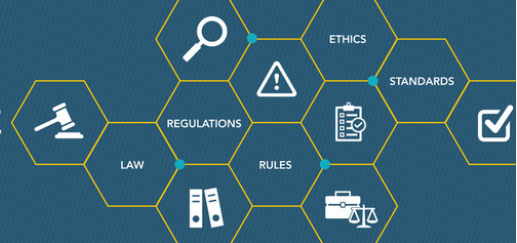

<!DOCTYPE html>
<html lang="en">
<head>
    <meta charset="UTF-8">
    <meta name="viewport" content="width=device-width, initial-scale=1.0">
    <meta http-equiv="X-UA-Compatible" content="ie=edge">
    <title>Longni John Tao & Co.</title>
    <!-- <link href="https://www.littlesnippets.net/css/codepen-result.css" rel="stylesheet"> -->
    <link href="https://fonts.googleapis.com/css?family=Montserrat:400,500&display=swap" rel="stylesheet">
    <link rel="stylesheet" href="https://maxcdn.bootstrapcdn.com/font-awesome/4.7.0/css/font-awesome.min.css">
    <link rel="stylesheet" href="https://cdnjs.cloudflare.com/ajax/libs/font-awesome/4.7.0/css/font-awesome.min.css">
    <link href="https://fonts.googleapis.com/css?family=Lato:300,400&display=swap" rel="stylesheet">
    <!-- AOS css -->
    <link rel="stylesheet" href="https://unpkg.com/aos@next/dist/aos.css" />
    <link rel="stylesheet" href="css/style.css">
    <!-- salJS script -->
    <link rel="stylesheet" href="./node_modules/sal.js/dist/sal.css">
    
    <!-- smooth scroll js-->
    

</head>

<body oncontextmenu="return false">  
    <!--######### Nav bar ############-->
    

        <header>
            <nav>
                

                    <i class="fa fa-bars fa-2x"></i>
                

                

                    L J T
                

                

                    <ul>
                        <li><a href="http://longnitao.com/">Home</a></li>
                        <li><a href="#jump2service">Services</a></li>
                        <li><a href="#jump2about">About</a></li>
                        <li><a href="#jump2contact">Contact</a></li>
                    </ul>
                

            </nav>
        </header>
    

    <!-- main page starts here-->
    

        

            
                longni john tao & co.
            
        

        

            
             
             
                chartered accountants
            
        

    

    <section class="section section-light">
    </section>

    <!-- smoke animation starts here-->
    
 
        

    

    

            <h3 style="text-align: center; font-size: larger; text-transform: uppercase;">Start-up services</h3>
             
                Our services to “start-up” units in North Eastern States of India combine the in-depth knowledge of various sections of the industry in combination of advice on company law matters, such as which type of business association is most appropriate, tax holidays and exemptions available, how to set up a company, how the company is to be managed, employment law matters and duties of directors, and documents needed to run the company, such as minutes of meetings, constitutional documents, shareholders agreement, and contracts with suppliers and customers.
            <ul>
                <li>Incorporation of Companies and Limited Liability Partnership (LLP)</li>
                <li>Formation and registration of Society, Trust, Partnership, Clubs etc</li>
                <li>FCRA registrations, compliance and filing of periodical returns.</li>
                <li>Drafting of agreements – Rent agreement, Sales Deed, Partnership Deed, AOA, MOA, Trust</li>
                <li>Deed, LLP Deed etc.</li>
                <li>Digital signature certificates (DSC) and DIN.</li>
                <li>egistration under Shops and Establishment Act 1972,</li>
                <li>Obtaining license – Food, Trade, IEC, Trademark etc.</li>
                <li>FSSAI certificate</li>
                <li>Organic certified</li>
                <li>MSME registration</li>
                <li>2AA, 80G registration</li>
                <li>NITI AAYOG registration</li>
            </ul>
        
    

    

        <h3 style="text-align: center; font-size: larger; text-transform: uppercase;">Accounting and business process outsourcing</h3>
         
            We endeavor and focus to increase the profitability and efficiency of our clients in providing the following services.
        <ul>
            <li>Complete End to end accounting – Tally software, Quickbooks & Bookkeeper</li>
            <li>Book-keeping.</li>
            <li>Year-end financial reporting.</li>
            <li>Consolidation and management accounting</li>
            <li>Administration of Fixed Assets Register, Payroll and Bank Reconciliatio</li>
            <li>Invoicing of sales and accounts receivable</li>
            <li>Staffing solutions</li>
            <li>Budgeting and management reporting</li>
            <li>Company secretarial services</li>
            <li>Improved internal control</li>
            <li>Part time CFO services:
                <ul>
                    <li>Preparation and explanations of management accounts.</li>
                    <li>Cash flow projections.</li>
                    <li>Budgeting – interim and annual.</li>
                    <li>verview of bookkeeping and month end closes.</li>
                    <li>Debtor and creditor management.</li>
                    <li>Project management of the financial component of new ventures.</li>
                    <li>Compliance management – corporate, taxation and other laws.</li>
                    <li>Review and assessment of internal controls</li>
                    <li>Revenue management, working capital management, MIS and Analytics</li>
                </ul>
            </li>
        </ul>
        
    

    

        <h3 style="text-align: center; font-size: larger;text-transform: uppercase;">Audit and assurance</h3>
         
        The proprietor has vast and varied experience in conducting all types of Audits for large & medium sized business entities under IGAAP, IND AS and IFRS. We provide the following audit and assurance services:
        <ul>
            <li>Statutory Audit under Companies Act</li>
            <li>Audit of Partnership, Schools, Trust, Societies etc</li>
            <li>Tax Audit under Income Tax Act</li>
            <li>Internal Audit and Management audit</li>
            <li>Bank Auditing</li>
            <li>Proprietary Audit</li>
            <li>Individuals and contractors audit</li>
            <li>Stock Audit</li>
            <li>GST Audit</li>
            <li>Certifications and due diligence.</li>
        </ul>
        
    

    

        <h3 style="text-align: center;font-size: larger;text-transform: uppercase;">Taxation</h3>
         
            Today, from individuals to firms or to corporate, all require to comply with numerous direct tax and indirect laws which are complicated and need to be completed in a time bound and efficient manner. We provide the following types of services in Direct and Indirect taxation.
        <ul>
            <li>Indirect taxation:
                <ol>
                    <li>Tax planning and management</li>
                    <li>Filing of return of income, tax deducted at source etc.</li>
                    <li>Compliances of advance tax/TDS rules and regulations</li>
                    <li>Obtaining TDS exemption certificates.</li>
                    <li>Professional tax</li>
                    <li>Representing client before various tax authorities for assessments, appeals, and search & seizure cases.</li>
                    <li>Personal taxation – tax returns, tax assessment, wealth management and VISA procedure.</li>
                </ul>
            </li>
            <li>Indirect taxation:
                <ol>
                    <li>Registration of GST</li>
                    <li>Ascertainment of tax liability</li>
                    <li>Filing of returns,</li>
                    <li>Representing client before various tax authorities for assessments, appeals and search & seizure cases.</li>
                </ol>
            </li>
        </ul>
        
    

    

        <h3 style="text-align: center; font-size: larger;text-transform: uppercase;">Project consulting</h3>
         
            Finance is the bloodline for any business and we carefully analyse the current needs and situation and accordingly help prepare project reports to arrange finance in the form of working capital, cash credit, project loans and term loans from Banks and financial institutions. We also offer due diligence for finance.
             
            We prepare claim for various subsidies available from the Central as well as State Governments and render certification services:
        <ul>
            <li>Preparation of project reports.</li>
            <li>Loan arrangement/ Loan syndication – working capital, cash credit limit, term loan & project loan.</li>
            <li>Certifications requirement.</li>
            <li>Due diligence for finance.</li>
            <li>Consultancy for subsidy, concession loan and grant in aid available.</li>
            <li>Preparation of all documents for filling of subsidy claim.</li>
            <li>Certification of certificates to be filed along with subsidy claims.</li>
            <li>Representing the client for clarification to the Government Authorities.</li>
        </ul>
        
    

    

        <h3 style="text-align: center; font-size: larger;text-transform: uppercase;">Secretarial compliances</h3>
         
        <ul>
            <li>Compliance and assisting in maintaining statutory registers and records.</li>
            <li>Filing of required documents with the ROC etc.</li>   
            <li>Filing of annual return & annual accounts.</li>
        </ul>
        
    

    

        

            
                Services
            
        

    

<section class="services-sect">
      
    

        <section class="card1" data-aos="fade-right">
          
          
Click to learn about this service in detail

            <h3>STARTUP SERVICES</h3>
            
        </section>

        <section class="card2" data-aos="fade-left" >
          
          
Click to learn about this service in detail

              <h3>ACCOUNTING & BUSINESS PROCESS OUTSOURCING</h3>
            
        </section>

        <section class="card3" data-aos="fade-right">
          
          
Click to learn about this service in detail

            <h3>AUDIT AND ASSURANCE</h3>
          
        </section>

        <section class="card4" data-aos="fade-left">
          
          
Click to learn about this service in detail

            <h3>TAXATION</h3>
            
        </section>

        <section class="card5" data-aos="fade-right">
          
          
Click to learn about this service in detail

            <h3>PROJECT CONSULTANCY</h3>
          
        </section>

        <section class="card6" data-aos="fade-left">
          
          <
Click to learn about this service in detail

            <h3>SECRETARIAL COMPLAINCE</h3>
            
        </section>   
    

        
</section>

    

        

            
                About Us
            
        

    

    <section class="section section-dark">
        <h2>Founder & Proprietor</h2>
        

        CA Longni John Tao, B. Com (H), FCA is a fellow member of the Institute of Chartered Accountants of India (ICAI). He acquired his member in 2013 and have worked in a leading audit and tax consulting firm viz. Deloitte for more than 5 years in Bangalore. He is extensively involved in audits under IGAAP, IFRS and Tax audit under Income Tax Act 1961 both for listed and unlisted Companies. He has also knowledge in statutory audit of bank branches, risk based internal control audit and GST audit. Further he has also large knowledge in certifications both statutory and specific, end-to-end accounting and statutory compliances and project reviews. He is the first Chartered Accountant from Senapati District Manipur.
        

    </section>

    

    <section class="section section-dark">
        <h2>Our Vision</h2>
        

        We value an act with high standards of HONESTY and INTEGRITY for success in all the areas of life including profession and the firm.
         
         
        We strive to continuously improve our QUALITY of service.
         
         
        We are committed to create an IMPACT that matters to one another and for the society as a whole.
        

    </section>
    
    

    <section class="section section-dark" >
        <h2>Our mission</h2>
        

        We will predominantly work with organization in the North East India region as partners to help them achieve their desired outcomes from the growing market. We will build trust and provide our customer with guidance to the solution we believe is the best-in-practice.
          
        Our focus is help start-ups and other small & medium sized business owners in starting, managing andgrowing their business with compliance and profitability.
        

    </section>

   
    <h2 style="text-align: center; font-family: 'Montserrat', sans-serif; color: black;">Mail us your concerns</h2>
    

        <form action="/?page_id=143#wpcf7-f156-p143-o1" method="post" class="wpcf7-form" novalidate="novalidate">
            

                <input type="hidden" name="_wpcf7" value="156">
                <input type="hidden" name="_wpcf7_version" value="3.7.2">
                <input type="hidden" name="_wpcf7_locale" value="en_US">
                <input type="hidden" name="_wpcf7_unit_tag" value="wpcf7-f156-p143-o1">
                <input type="hidden" name="_wpnonce" value="d1da331d93">
            

            

               
                 <input type="text" name="Name" value="" size="40" class="nameinput wpcf7-form-control wpcf7-text wpcf7-validates-as-required" aria-required="true" aria-invalid="false" placeholder="Name">
              
              
                <input type="email" name="Email"  size="40" class="emailinput wpcf7-form-control wpcf7-text wpcf7-email wpcf7-validates-as-required wpcf7-validates-as-email" aria-required="true" aria-invalid="false" placeholder="Email">
              
              
                <input type="text" name="Subject"  value="" size="40" class="subjectinput wpcf7-form-control wpcf7-text wpcf7-validates-as-required" aria-required="true" aria-invalid="false" placeholder="Subject">
              
              <!-- 
                <select name="Subject" class="indent wpcf7-form-control wpcf7-select wpcf7-validates-as-required" aria-required="true" aria-invalid="false">
                  <option value="General">General</option>
                  <option value="Booking">Booking</option>
                </select>
               -->
              
                <textarea name="Message" cols="40" rows="10" class="wpcf7-form-control wpcf7-textarea" aria-invalid="false" placeholder="Message"></textarea>
              
              <input type="submit" value="Send" class="wpcf7-form-control wpcf7-submit btn">
              
          

          

          

      </form>
    

    

        

            <section class="contact" data-aos="fade-left">
                <h2>Contact Us</h2>
		<h3>Email: ljt@longnitao.com<h3>
                <section class="address" data-aos="fade-left">
                    <h3>Address</h3>
                        1st Floor, Next to St. Anthony's Jr. Block Building, 
                        near Broadway Complex, NH-2 
                        Senapati District HQ 
                        Pin-Code: 795 106 
                        City- Imphal, Manipur, India. 
                        Tel: 03871 222566
                </section>
                <section class="hours" data-aos="fade-left">
                    <h3>Working Hours</h3>
                        Monday - Saturday: 10:00AM - 05:00PM
                </section>
            </section>

            <section class="links" >
                <h2 style="text-align: center;" data-aos="fade-right">Related Links</h2>
                <section class="col1">
                    <ul>
                        <li data-aos="fade-right"><a href="http://www.incometaxindia.giv.in/">Income Tax of India</a></li>
                        <li data-aos="fade-right"><a href="http://www.mca.gov.in/">Companies Act of India</a></li>
                        <li data-aos="fade-right"><a href="http://www.dipp.nic.in/">Ministry of Udyog</a></li>
                        <li data-aos="fade-right"><a href="http://www.rbi.org.in/">Reserve Bank of India</a></li>
                        <li data-aos="fade-right"><a href="http://www.gst.gov.in/">Goods and Service Tax</a></li>
                        <li data-aos="fade-right"><a href="http://www.dgft.delhi.nic.in/">Directorate General of Foreign Trade</a></li>
                    </ul>  
                </section>
                <section class="col2">
                    <ul>
                        <li data-aos="fade-right"><a href="http://www.finmin.nic.in/">Ministry of Finance</a></li>
                        <li data-aos="fade-right"><a href="https://msme.gov.in/">MSME</a></li>
                        <li data-aos="fade-right"><a href="http://www.kvic.org.in/">Khadi and Village Industries Commission</a></li>
                        <li data-aos="fade-right"><a href="http://www.necouncil.gov.in/">North Eastern Council</a></li>
                        <li data-aos="fade-right"><a href="https://mdoner.gov.in/">DONER</a></li>
                    </ul>
                </section>
            </section>
        

        

        <section class="cpy" data-sal-duration="1200"
        data-sal="fade-down"
        data-sal-delay="300"
        data-sal-easing="ease-out-bounce">
            
<strong>© 2020 Longni John Tao & Co. | All Rights Reserved</strong>

            <section class="giticon">
            <a href="https://github.com/S-T-R-i-F-E"><i class="fa fa-github" style="font-size:36px"></i></a>
            </section>
            <section class="gitname">
                webpage created by: S-T-R-i-F-E(Benson Kho)
            </section>
        </section>
    

    
    

    
      

    <!-- ###### AOS script ##########-->
    
     

 

</body>
</html>
